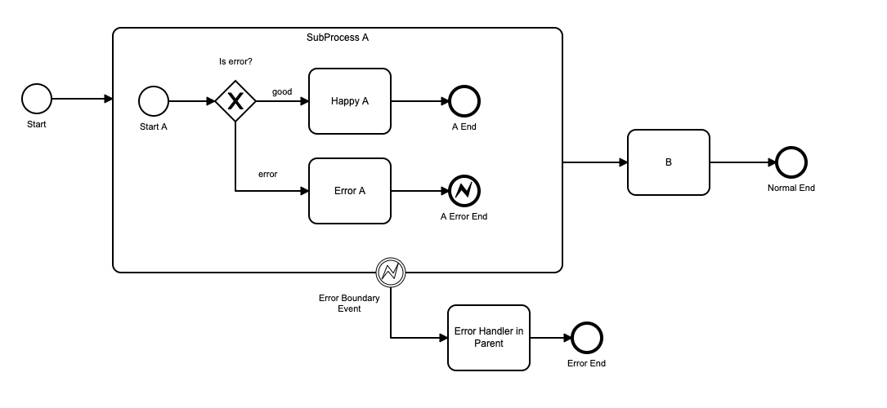

# Behavior of Boundary Conditions in Sub-Processes

This is where things get a little complex - but understanding and mastering this complexity will help you build powerful business processes without getting distracted by all of the painful details of handing process errors, escallation, and all of those other things that turn your simple process model into spagetti!

One of the good practice modeling concepts  in BPMN is to focus the model on the usual, happy-case path.  So your model should flow, left to right, along the happy case scenario.  The mess of

Boundary Conditions come in several flavours, to handle:

- process errors
- process escallation
- timeouts
- reminders
- interruptions

Boundary Conditions can be attached to tasks (and task like activities) and to sub-processes.  This setion covers behaviour of boundary conditions when applied to sub-processes only.

### Error EndEvents and Error Boundary Events.

This process has a SubProcess A.  In the sub-process, there is an exclusive gateway which tests for a process error.  If there is a *process error*, the process ends at an Error End Event.

Note that an error in this context is a *process error*, not a technical error in the application -- which would be handled by the application technology.

- An Error End always interupts processing in the sub-process.  Processing in the sub-process, and any of its child sub-processes, are terminated.
- If the immediate parent process contains an Error Boundary Event, processing continues on that path in the immediate parent.
  - In the  example above, the path would be: Error A -> A error End -> Error Boundary Event -> Error Handler in Parent -> Error End.
- If the immediate parent process doesn't contain an Error Boundary Event, processing continues on the normal path in the immediate parent.
  - In the example above, if there is an errorEnd but NOT a error Boundary Event, the path would be: Error A -> A Error End -> B -> Normal
