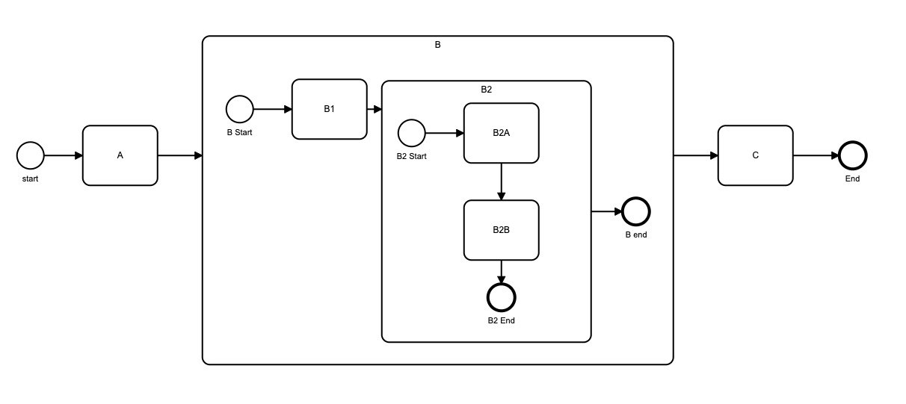

## Sub Processes

### General

BPMN allows encapsulation and detail hiding through the use of Sub Processes.  These can be defined in a diagram, allowing the details of a process to be hidden from the top level process.

Flows for APEX allows you to create sub processes within your process.  Sub processes can contain other sub processes, and so a deep hierarchy of processes and sub processes can be built.  There is no arbitrary limit to how deep sub processes can be stacked -- although everything must be contained in a single BPMN diagram currently.

### Creating Sub Processes

Sub Processes are created using the modeller, as usual.

### Current Limitations

#### 1. Sub Processes must have 1 Start Event and 1 End Event

A Sub Process must start with a single Start Event, which should be a simple Start Event (i.e., without any associated Timer, etc. event)

#### 2. Sub Processes should operate in a single Lane

As is good BPMN style, a sub process should operate in a single lane.

#### 3. Sub Processes cannot contain a Terminate End Event

Sub processes can currently only contain a single, standard End Event.  Terminate End Events are not currently supported.
