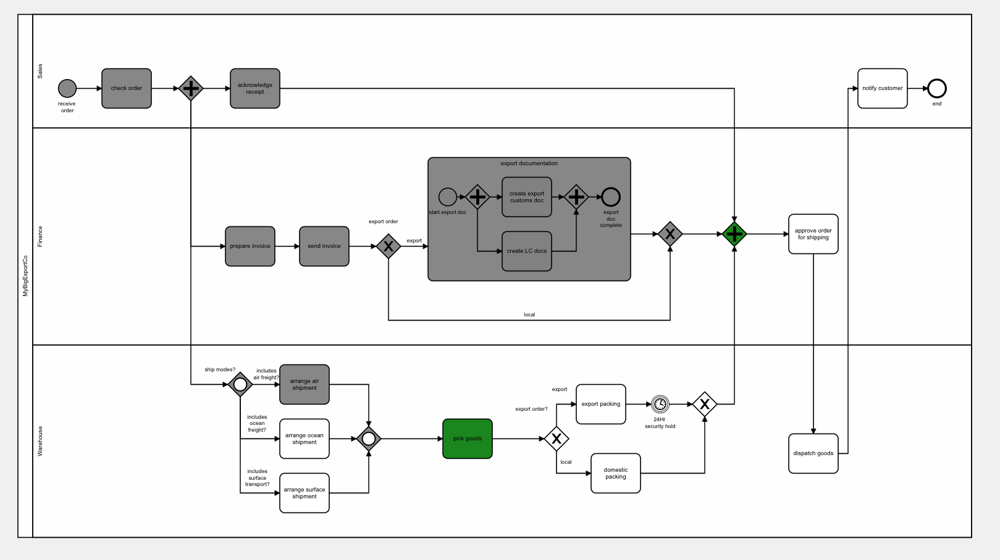
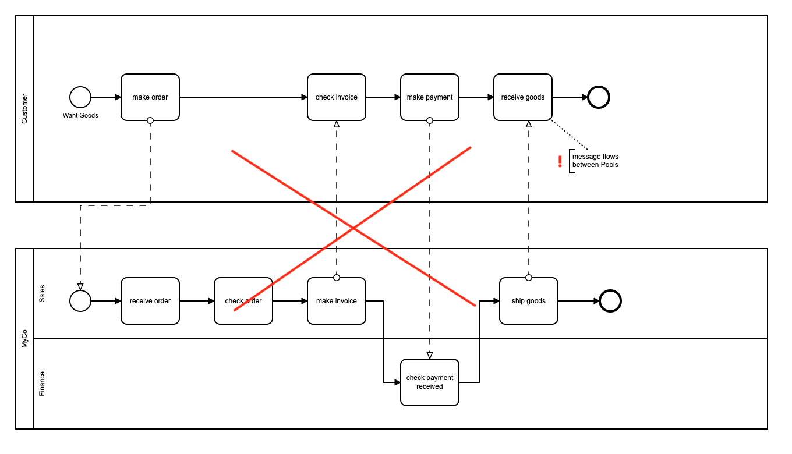

## Using Lanes

### Introduction

BPMN provides features to model who is performing activities and tasks in a modelled business process.

### Current Support

Flows for APEX V4 now supports a process running in a pool of 1 or more lanes.  Within a pool, process progression occurs using sequence flows.  A well-formed BPMN diagram will contain named lanes showing who performs the process activities.

In this example, the process occurs in one pool ("MyBigExportCo"), and has three process lanes - Sales, Finance, and Shipping.

When this example is run, the lane information of the current tasks on each running subflow are available to the application, and could be used to make next task inboxes for users servicing that pool.

### Cross Pool Processes

Processes which are defined with multiple pools use message flows and signal flows to define communication between process objects in different pools, rather than sequence flows which are used inside a pool.

Flows for APEX does not currently support processes using message flows and signal flows, and so multi-pool diagrams cannot currently be run.

This example models (correctly, in BPMN terms!) the customer and company in separate pools.  However, Flows for APEX cannot currently handle the messageflows across pool boundaries.  Sequence flows have to be contained inside a pool.
